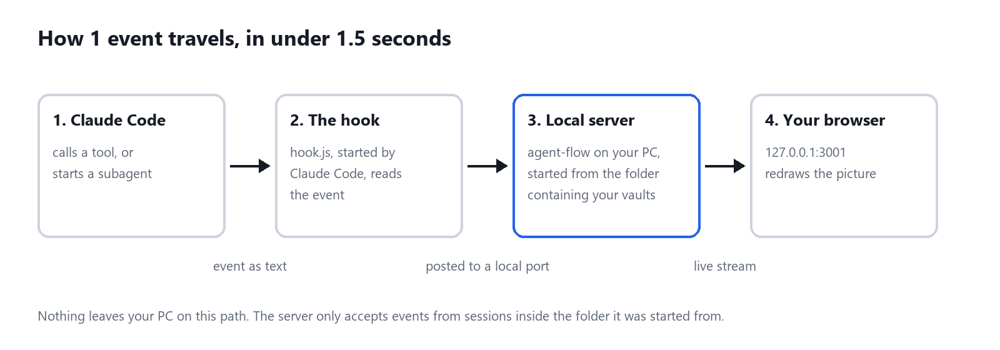
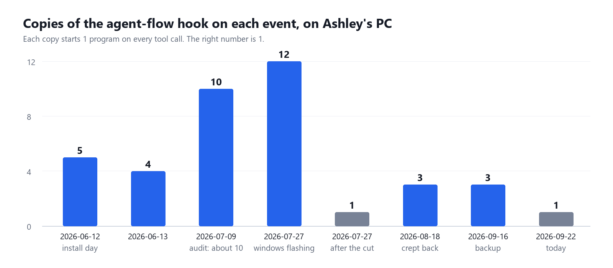
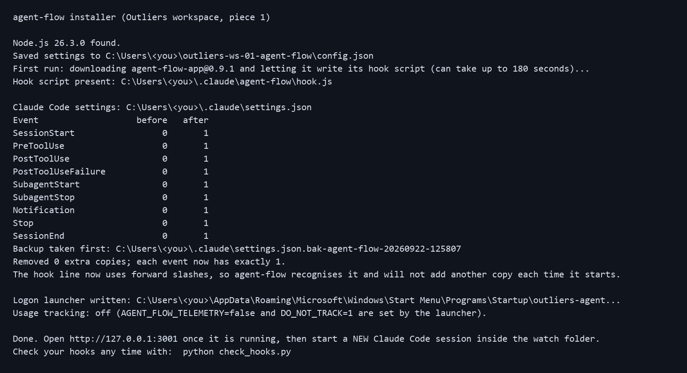
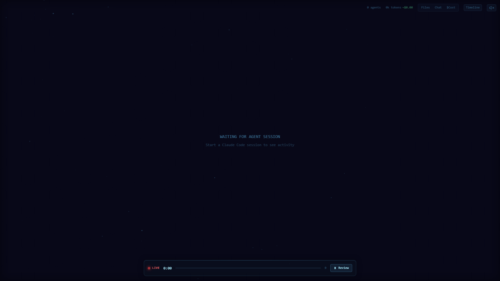
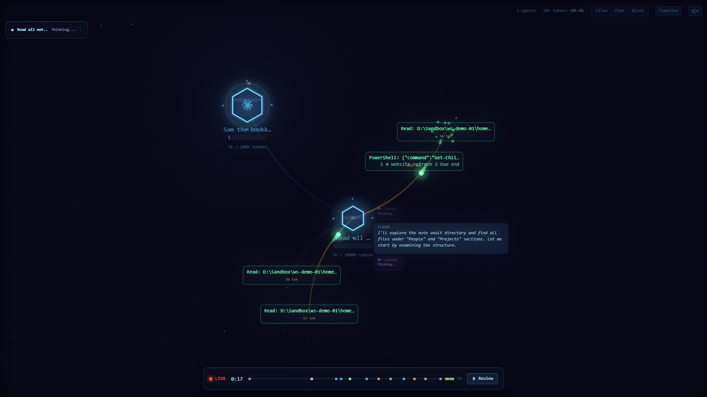

## What it is

agent-flow is a free web page that runs on your own computer. Open it in your browser at http://127.0.0.1:3001 while Claude Code is working and you see a dark screen with a glowing hexagon. That hexagon is your Claude Code session. When the session hands a job to a subagent (a second Claude that does 1 task and reports back), a second hexagon appears and a line is drawn between them. Every tool call, such as reading a file or running a command, pops up as a small card beside the agent that made it.


Along the top of the page are tabs, 1 per Claude Code session running on your computer. Each tab is titled with the first words of that session's opening message. Top right shows how many agents are running, an estimate of tokens used and an estimated cost. Along the bottom is a timeline with a LIVE marker and a Review button that replays what happened.

agent-flow was written by another developer and published as open source under the Apache 2.0 licence (github.com/patoles/agent-flow; npm package `agent-flow-app`, version 0.9.1 checked on 2026-09-22). It also comes as a VS Code extension. Our download does not contain agent-flow. It contains an installer and 3 small checks that set agent-flow up safely, because the stock install has 2 faults on Windows that cost us weeks. Both are explained below.

## Why you would want it

When you run agents, most of the work is invisible. You type a request, the terminal scrolls, an answer arrives. You do not see which subagents were called, in what order, or which files they opened. That matters in 3 situations:

- **Building an agent.** Its instructions say it calls 3 specialists. Does it? On this screen you see every subagent it really starts and every file it really reads.
- **Something is slow or expensive.** You see the moment a session fans out into 5 subagents, or reads the same file 4 times.
- **Showing your work.** A client or a video viewer understands "the agents handed the job along" in 5 seconds when they watch it happen.

It shows what happened. It does not change anything your agents do.

## How we built it

This is how Ashley set agent-flow up on his own Windows PC, what broke, and what we kept. Every date and count below was read from his files, settings backups and logs on 2026-09-22.



First, how it works, because every fault below follows from it. Claude Code lets you register a **hook**: a command it runs every time a given event happens, such as "a tool is about to be used" or "a subagent has started". agent-flow registers a small script, `hook.js`, on 9 events. Each time 1 fires, Claude Code runs `hook.js` and hands it a description of the event. The script looks in the folder `<your home>/.claude/agent-flow/` for small files that say where a running agent-flow server is listening, and sends the event there. The server updates its picture and your browser redraws.

### 2026-06-12: install day

- Installed with `npx -y agent-flow-app`. On its first run the package wrote `hook.js` and added it to 9 events in Claude Code's `settings.json` file: SessionStart, PreToolUse, PostToolUse, PostToolUseFailure, SubagentStart, SubagentStop, Notification, Stop and SessionEnd.
- **Windows fix 1, the launch folder.** The server remembers the folder it was started from, and only accepts events from Claude Code sessions running inside that folder. Started from the wrong place, it shows nothing. So it was set to start from the Documents folder, the parent of every vault.
- **Start at logon, hidden.** A file called `agent-flow.vbs` went into the Windows Startup folder. It runs `npx -y agent-flow-app --no-open` with the window hidden.
- **The merged view, tried and reverted.** Ashley wanted every session on 1 screen instead of 1 tab each. A patch to agent-flow's server merged all sessions into 1 stream. The data looked right, and it was reported as done without anyone looking at the screen. Ashley's reply: "that hasn't worked - It's not working at all." agent-flow's drawing code supports exactly 1 main hexagon per screen, so 6 main hexagons stacked on the same spot and their labels garbled. It was put back to the stock package. The lesson kept from it: check any change to a screen with a screenshot, never by reading the data behind it.
- The 1-screen wish went to a different tool, FleetView, which is piece 2 of this series.
- A backup of `settings.json` taken at 17:00 that day already had **5 copies** of the agent-flow hook on every event. The next day's backup had 4.

### Windows fix 2: stale registration files (date not recorded)

Each time the server starts it writes a file named `<code>-<process number>.json` into `<home>/.claude/agent-flow/`, saying which port it listens on and which folder it watches. The hook is meant to delete files for servers that have stopped. On Windows its "is this server still alive?" check is written to always answer yes. Worse, when several files match a session's folder, the hook sends only to the server watching the **narrowest** folder. So an old file for a narrower folder swallows every event while the real server sits idle, and the screen just stays empty. The fix was to delete the old files and keep the one whose server is running. 13 such files were still sitting in that folder on 2026-09-22, dated 2026-06-12 to 2026-08-06.

### 2026-07-09 to 2026-09-16: the hook copies pile up



- **2026-07-09:** an audit found the hook registered about 10 times on every event.
- **2026-07-19:** `npx` pulled the newer agent-flow 0.9.1.
- **2026-07-27:** Ashley: "Instances keep opening on my PC." The settings file had 112 hook entries in total; agent-flow's was on every event 12 times. Each tool call started about 27 small console programs, and each flashed a window on screen. Everything was cut to 1 copy per event and command: 112 entries down to 13.
- **2026-08-18:** it had crept back to 3 per event.
- **2026-09-16:** a backup shows 3 per event. On 2026-09-22 the file shows 1 per event. No written record of that second cleanup was found.

At the time, why the copies piled up was not recorded. While building this kit on 2026-09-22 we read agent-flow 0.9.1's own set-up code and found a cause. Before adding its hook, agent-flow checks whether it is already there by searching your settings for the text `agent-flow/hook.js`, with a forward slash. On Windows the path it writes uses backslashes: `agent-flow\hook.js`. The search never matches its own entry, so **every time the server starts, it adds another copy to all 9 events**. We tested it in a throwaway folder: 3 starts gave 3 copies per event. A server that starts at every logon, plus manual restarts during fixes, matches every rise in the chart. We cannot prove it was the only cause, because nobody logged each start, but it explains every rise above.

Our fix changes only the direction of the slashes: the installer writes the same hook with forward slashes (`C:/Users/<you>/.claude/agent-flow/hook.js`). Windows accepts forward slashes, and agent-flow now recognises its own entry and leaves your settings alone. Tested the same day: with our line in place, 2 more starts changed nothing.

### The usage-tracking finding

agent-flow 0.9.1 sends anonymous usage events (an install code, its version, your operating system, session length) to a server run by its author, unless you set `AGENT_FLOW_TELEMETRY=false` or `DO_NOT_TRACK=1` before starting it. The GitHub page summary says tracking is off by default; the code says on. Trust the code. On Ashley's PC, 4 such events were logged between 2026-07-19 and 2026-08-06, because his launcher set neither switch. Our launcher sets both.

### 2026-08-06: switched off

At 17:25 on 2026-08-06 the Startup entry for agent-flow was switched off in Windows' Startup apps list, in the same minute as the FleetView dashboard. Who did it and why was not written down. His failure log for 2026-09-22 says these screens were "stopped not deleted" when his work changed direction. The hooks were left in place, so every tool call still started 1 `node` program that found no server and quit. That is a small, silent cost, and our uninstall removes it.

### What we kept for you

- The stock agent-flow package, installed by you from npm. No patched copy.
- The forward-slash hook line, so copies never pile up.
- A hidden launcher that starts from the folder that contains your vaults, with usage tracking off.
- `cleanup.py` for the stale files, run automatically before every start.
- `check_hooks.py`, a count of every hook on every event.

## Pros and cons

| | Pros | Cons |
|---|---|---|
| Cost | Free and open source. Uses no Claude tokens itself. | Every tool call starts 1 small `node` program (up to 1.5 seconds, it never blocks Claude). It does this even when the server is off, until you uninstall. |
| Setup | About 1 minute with our installer, plus the first download. | Needs Node.js, which most people do not have yet. |
| What you see | Subagents appear the moment they start; every tool call is a card; Review replays a run. | 1 session per tab. There is no single screen with every session (our attempt failed, see above). |
| Accuracy | Tool calls and subagents come straight from Claude Code's own events. | Token counts and costs are estimates. On Ashley's PC they disagreed with FleetView for the same session. |
| Privacy | The page only listens on your own computer. | Tab titles show the first words of your prompts, so take care when screen-sharing. Usage tracking is on unless switched off (our launcher switches it off). |
| Windows | Our kit fixes the 2 known Windows faults. | Stale registration files still appear if the server is killed rather than stopped; `start.py` cleans them before each start. |

## Before you start

| You need | How to check | If it is missing |
|---|---|---|
| Claude Code | `claude --version` | You have it from earlier sessions. |
| Python 3.8 or newer | `python --version` (Mac: `python3 --version`) | python.org |
| Git | `git --version` | git-scm.com |
| Node.js 18 or newer (20 recommended) | `node --version` | Windows: the LTS installer from nodejs.org, or `winget install OpenJS.NodeJS.LTS`. Mac: nodejs.org or `brew install node`. Then open a NEW terminal. |
| Port 3001 free | Open http://127.0.0.1:3001 in a browser; it should fail to load | Pick another port with `--port 3002` |

You also need to know where your second brain vault and your CRM vault live. The installer finds them for you if you installed them from our earlier kits, because those left small pointer files called `.outliers-sb` and `.outliers-crm` in your home folder.

## Install it

1. Open a terminal in your home folder (Windows: PowerShell; Mac: Terminal).
2. Run the clone and install line:

```
git clone https://github.com/OUTLIERS-ai/outliers-ws-01-agent-flow; cd outliers-ws-01-agent-flow; python install.py
```

   On a Mac use `python3`. Keep the folder where it lands: the logon launcher points at it.
3. Answer 3 questions. Press Enter to accept the suggestion in square brackets.
   - Where is your second brain vault?
   - Where is your CRM vault?
   - Which folder should agent-flow watch? It suggests the folder that contains both vaults. It must contain every folder you run Claude Code in, or those sessions will not show.
4. Wait for the first run. The installer downloads agent-flow and starts it once, hidden, with a throwaway home folder, so it writes its own `hook.js` without touching your settings. It copies that script into your `.claude/agent-flow` folder and stops it. This can take up to 3 minutes on a slow connection. No login is needed.
5. Read the table. Every event should show `1` in the "after" column. If you had old copies, the "before" column shows how many, and a dated backup of your settings is named on screen.



6. Start it now: `python start.py`. From now on it also starts by itself, hidden, each time you log in.
7. Open http://127.0.0.1:3001. You see "Waiting for agent session".



8. Open a **new** Claude Code session inside one of your vaults. Sessions that were already open show nothing, because Claude Code reads hooks only when a session starts. Ask it for something that uses a subagent, for example: "Use a subagent to list the notes in my People folder, then summarise them in 2 lines." A hexagon appears, then a second hexagon with a line to it.


9. Run `python check_hooks.py`. It should end with `RESULT: OK`.

> **Tip:** to remove everything later, run `python install.py --uninstall`. It stops the server, takes a backup, removes the 9 hook entries, and deletes the launcher. Your settings go back to how they were.

## Using it day to day

- **Leave the page open in a browser tab** while you work. Switch tabs at the top to follow a different session.
- **Press Review** on the bottom bar to replay a run that has finished.
- **The Files, Chat, Cost and Timeline buttons** top right open side panels: which files were touched, the conversation, the estimated cost, and a timeline of every call.
- **Check your hooks once a week:** `python check_hooks.py`. Anything other than 1 per event means something else has been writing to your settings.
- **If the page goes quiet:** run `python start.py --stop`, then `python start.py`, then open a new Claude Code session.
- **If you move your vaults**, run `python install.py` again and give the new watch folder. Nothing else changes.
- **Screen-sharing:** close the tab or pick a demo session first. Tab titles show the start of your prompts.



## Fit it to your own AI system

Each idea below comes with a prompt you can paste into Claude Code, opened in the `outliers-ws-01-agent-flow` folder unless it says otherwise.

1. **See your second brain AND your CRM in 1 place.** The server only hears sessions inside its watch folder. If your CRM lives at `C:\Users\<you>\CRM` and your second brain in `Documents`, the only folder containing both is your home folder.

```
Read config.json. Tell me whether my second brain vault and my CRM vault are both inside watch_folder. If not, run install.py again with --watch-folder set to the nearest folder that contains both, and show me the before and after.
```

2. **Watch the content engine write a wave.** Run your content engine from a folder inside the watch folder, open agent-flow, and start a wave. You will see which steps call subagents and which run as plain code.

```
My content engine lives at <path>. Check whether it is inside the watch_folder in config.json. If it is not, tell me the smallest change: move the folder, or widen the watch folder. Do not move anything without asking.
```

3. **Check an agent you are building really does what its instructions say.** Open the agent's file, list what it claims to call, run it with agent-flow open, and compare.

```
Read ~/.claude/agents/<agent-name>.md. List every subagent, tool and file it says it uses, as a checklist. I will run it now with agent-flow open and tell you what cards appeared. Then mark each checklist line as seen, not seen, or seen but not listed.
```

4. **Give every subagent a real name.** A subagent started without a registered name shows as an anonymous hexagon. Named agents make the picture readable.

```
Search my second brain's CLAUDE.md and my agent files for places that start a subagent with a generic type such as general-purpose. List each one and suggest which named agent from ~/.claude/agents/ should be used instead. Change nothing yet.
```

5. **Keep a permanent log.** agent-flow keeps no history once the server stops. Add a second, separate hook that appends each event to a dated file, then summarise a day into your second brain.

```
Add ONE new hook to my Claude Code settings.json on SubagentStart and SubagentStop that appends the event as 1 JSON line to ~/.claude/agent-events/YYYY-MM-DD.jsonl. Use a Python script run with pythonw.exe so no window opens. Take a dated backup of settings.json first, write it with a temp file and os.replace, and run python check_hooks.py afterwards to prove every event still has 1 copy of each command.
```

6. **Stop the empty spawns when the server is off.** If you only use agent-flow sometimes, every tool call still starts `node` for nothing. Remove the hooks when you stop, and put them back when you start.

```
Write stop_all.py and start_all.py in this folder. stop_all.py runs start.py --stop and then removes the agent-flow hooks using common.remove_agent_flow, with a backup. start_all.py puts the hooks back with common.install_agent_flow and runs start.py. Add tests using a temporary home folder, like the ones in tests/.
```

7. **Run it only when you want it.** Skip the logon launcher and make a desktop shortcut instead.

```
Run python install.py --no-autostart. Then create a desktop shortcut called "Agent screen" that runs start.py with pythonw.exe (Windows) so no window appears, and a second one that runs start.py --stop.
```

8. **Capture footage for content.** Record the page during a real multi-agent run: it makes short video of "the agents working" for a post.

```
Write capture.py: open http://127.0.0.1:3001 in headless Playwright at 1600 by 900, take a screenshot every 2 seconds until I press Ctrl+C, and save them numbered into a folder called captures with today's date. No visible browser window.
```

9. **Weekly hook check without a window.** Run the duplicate check once a week, hidden, and write the result into your second brain's inbox only when something is wrong.

```
Create a Windows scheduled task that runs check_hooks.py once a week on Monday at 09:00 through pythonw.exe, hidden. If the exit code is 1, write a short note into <second brain>/Inbox/ named YYYY-MM-DD hook duplicates.md with the output. Do not run it more often than weekly.
```

## When it goes wrong

| What you see | Why | Fix |
|---|---|---|
| The page says "Waiting for agent session" forever | The session was already open when the server started, or it runs outside the watch folder. | Open a NEW session inside the watch folder. Check the folder with `python start.py --status` and `config.json`. |
| Still nothing after a new session | A stale registration file for a narrower folder is catching the events (Windows). | `python cleanup.py`, then `python start.py --stop` and `python start.py`, then a new session. |
| Windows flash on every tool call | Hook copies have piled up. Before this kit, agent-flow added 1 more copy each time it started on Windows. | `python check_hooks.py --fix`, then `python install.py` to rewrite the line with forward slashes. |
| "Port 3001 is already in use" | Another program uses that port. | `python install.py --port 3002`, then open http://127.0.0.1:3002. |
| The installer stops: Node.js not found | Node is not installed, or the terminal was opened before installing it. | Install it (see Before you start), open a NEW terminal, run again. Nothing was changed. |
| The installer stops: could not read settings.json | The file has a typing error in it. | Open it, fix the error (a missing comma is common), run again. Nothing was changed. |
| Counts and costs differ from another dashboard | agent-flow's token and cost figures are estimates. | Treat them as a rough guide, not a bill. |
| A change you made to the screen "should work" but looks wrong | Reading the data is not the same as looking at the screen. That is how the merged-view patch failed on 2026-06-12. | Take a screenshot and look at it before calling it done. |

> **Warning:** do not run `npx agent-flow-app` by hand from a different folder while the launcher's copy is running. You get 2 servers, and sessions report only to the one watching the narrowest folder. Use `python start.py` instead.

## Download

The repository: https://github.com/OUTLIERS-ai/outliers-ws-01-agent-flow

```
git clone https://github.com/OUTLIERS-ai/outliers-ws-01-agent-flow; cd outliers-ws-01-agent-flow; python install.py
```

agent-flow itself: github.com/patoles/agent-flow (Apache 2.0). Our installer and checks: MIT.
